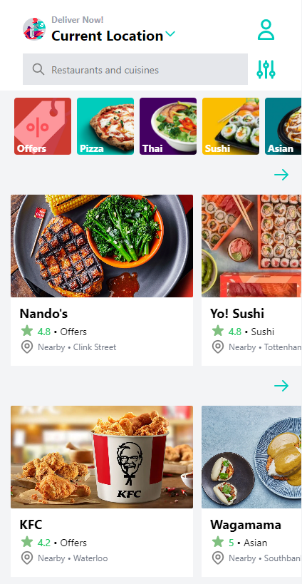
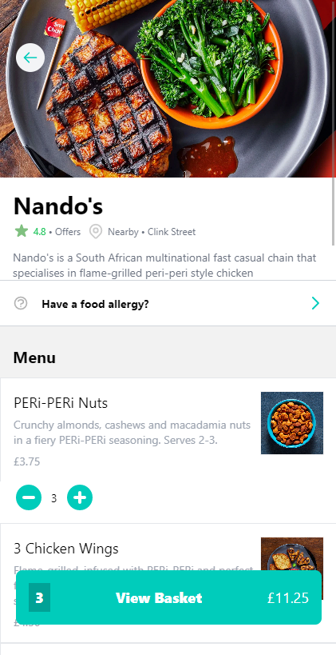
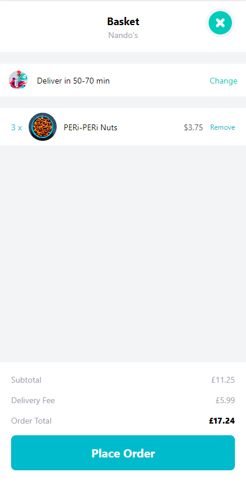
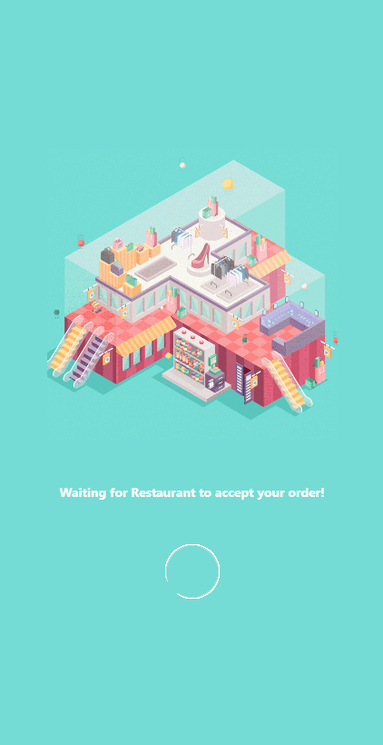

# deliveroo-react-native

<p float="left">
    
    
    
    
</p>

## Table Of Content

- [Description](#Description)
- [Running the project](#Running-the-project)

## Description

This project's a simple client only demo for food oredering app writen with react native and JavaScript. <br/>
The goal for this project was to learn React Native, this's my first project using React Native. <br/>

## Running the project

first clone the repo `git clone git@github.com:Refaelbenzvi24/deliveroo-react-native`

then run:

```shell
cd deliveroo-react-native
npm i
```

the run the following to start the dev server:

```shell
npm start
```
